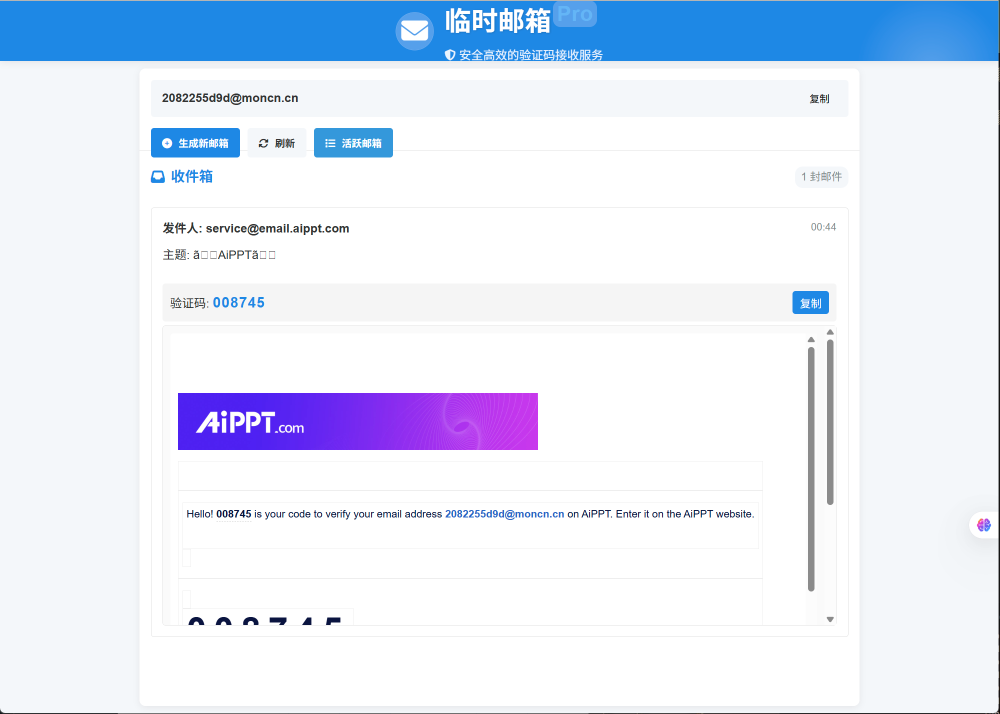

# 临时邮箱 - 验证码接收服务

<div align="center">

[](https://github.com/xinggaoya/mail-temp/stargazers)
[](https://github.com/xinggaoya/mail-temp/network/members)
[](https://github.com/xinggaoya/mail-temp/issues)
[](https://github.com/xinggaoya/mail-temp/blob/main/LICENSE)
[](https://goreportcard.com/report/github.com/xinggaoya/mail-temp)

### 一款轻量级、开源的临时邮箱服务

  
  <p>👆 临时邮箱系统界面预览</p>
</div>

一个简单、高效的临时邮箱服务，专为接收验证码设计。用户可以快速生成一次性邮箱地址，接收验证码邮件，无需注册真实邮箱即可完成网站验证流程。

## 功能特点

- 🚀 **即时生成**：一键生成临时邮箱地址
- 📨 **实时接收**：内置SMTP服务器，无需外部邮件服务
- 🔍 **智能识别**：自动提取邮件中的验证码（支持AI识别）
- 🔄 **自动刷新**：定期检查新邮件
- 📱 **响应式设计**：支持移动端和桌面端访问
- 🔒 **安全可靠**：邮件数据仅临时存储，保护用户隐私

## 技术栈

- **后端**：Go语言 (Gin框架)
- **前端**：HTML + CSS + Vue.js
- **邮件处理**：内置SMTP服务器 (go-smtp)
- **验证码识别**：集成Ollama AI模型支持
- **部署**：Docker容器化

## 快速开始

### 使用Docker部署

1. 克隆仓库

```bash
git clone https://github.com/xinggaoya/mail-temp.git
cd mail-temp
```

2. 启动服务

```bash
docker-compose up -d
```

服务将在以下端口运行：
- Web界面：7015端口 (http://localhost:7015)
- SMTP服务：25端口 (用于接收邮件)

### 环境变量配置

在`docker-compose.yml`中已配置好默认环境变量：

| 环境变量 | 描述 | 默认值 |
|---------|------|-------|
| MAIL_DOMAIN | 邮箱域名 | test.com |
| WEB_PORT | Web服务端口 | 8080 |
| DEBUG_MODE | 调试模式 | true |
| OLLAMA_API_URL | Ollama API地址 | http://172.17.0.1:11434/api/generate |

### AI验证码识别配置

项目集成了Ollama AI模型用于识别验证码，确保在宿主机上运行Ollama服务：

```bash
# 安装Ollama (如果尚未安装)
curl -fsSL https://ollama.com/install.sh | sh

# 拉取并运行gemma3:1b模型
ollama run gemma3:1b
```

## 使用方法

### Web界面使用

1. 访问Web界面：http://your-server-ip:7015
2. 点击"生成新邮箱"按钮，获取一个临时邮箱地址
3. 使用该邮箱地址在其他网站注册或接收验证码
4. 系统会自动接收邮件并提取验证码
5. 可以直接复制验证码使用，或查看完整邮件内容
6. 点击"刷新"按钮可以手动刷新邮件列表
7. 通过"活跃邮箱"按钮可以查看和管理已创建的邮箱

### 活跃邮箱管理

1. 点击"活跃邮箱"按钮查看当前所有可用的临时邮箱
2. 可以一键切换到其他邮箱查看收到的邮件
3. 不再需要的邮箱可以通过删除按钮移除
4. 系统最多显示15个最新创建的临时邮箱

### 邮件查看

1. 邮件按时间倒序排列，最新收到的邮件显示在顶部
2. 系统会自动识别邮件中的验证码并突出显示
3. HTML格式邮件会保留原始样式显示
4. 验证码会在主题下方高亮显示，并提供一键复制功能
5. 邮件内容支持自动滚动，便于查看长内容

## API接口

系统提供了以下API接口，可用于集成到其他应用中：

### 创建新邮箱
```
GET /api/email/new
```
返回示例:
```json
{
  "status": "success",
  "email": "abcd12345@example.com"
}
```

### 获取邮件列表
```
GET /api/email/:email/messages
```
返回示例:
```json
{
  "status": "success",
  "email": "abcd12345@example.com",
  "count": 1,
  "messages": [
    {
      "from": "service@example.com",
      "to": "abcd12345@example.com",
      "subject": "您的验证码",
      "body": "...",
      "htmlContent": "...",
      "code": "123456",
      "timestamp": "2023-05-01T12:34:56Z"
    }
  ]
}
```

### 获取活跃邮箱列表
```
GET /api/email/list
```
返回示例:
```json
{
  "status": "success",
  "count": 3,
  "emails": ["abcd12345@example.com", "xyz789@example.com", "temp123@example.com"]
}
```

### 删除邮箱
```
DELETE /api/email/:email
```
返回示例:
```json
{
  "status": "success",
  "message": "临时邮箱已删除"
}
```

## DNS配置

若要在生产环境使用，需要配置以下DNS记录：

1. **A记录**: 将域名指向服务器IP
   ```
   mail.yourdomain.com.  IN  A  your-server-ip
   ```

2. **MX记录**: 优先级10，指向邮箱域名
   ```
   yourdomain.com.  IN  MX  10  mail.yourdomain.com.
   ```

3. **SPF记录** (可选): 提高邮件发送可信度
   ```
   yourdomain.com.  IN  TXT  "v=spf1 ip4:your-server-ip ~all"
   ```

4. **DMARC记录** (可选): 增强邮件安全性
   ```
   _dmarc.yourdomain.com.  IN  TXT  "v=DMARC1; p=none; rua=mailto:admin@yourdomain.com"
   ```

## 本地开发

1. 安装Go 1.20或更高版本
2. 克隆仓库并安装依赖

```bash
git clone https://github.com/xinggaoya/mail-temp.git
cd mail-temp
go mod download
```

3. 运行应用

```bash
go run main.go
```

4. 开发调试

```bash
# 启用热重载（需要安装 air）
air

# 运行单元测试
go test ./...

# 构建可执行文件
go build -o mail-temp
```

## 项目结构

```
mail-temp/
├── cmd/            # 命令行工具
├── internal/       # 内部包
│   ├── config/     # 配置处理
│   ├── email/      # 邮件处理核心逻辑
│   ├── handler/    # HTTP请求处理器
│   └── repository/ # 数据存储接口
├── web/            # 前端资源
│   ├── static/     # 静态资源
│   └── templates/  # HTML模板
├── debug/          # 调试信息
├── docker/         # Docker相关文件
├── images/         # 文档图片
└── scripts/        # 部署和辅助脚本
```

## 贡献指南

我们非常欢迎社区贡献，以下是参与项目的方式：

1. **Fork本仓库**：点击页面右上角的Fork按钮
2. **创建功能分支**：`git checkout -b feature/amazing-feature`
3. **提交更改**：`git commit -m 'Add some amazing feature'`
4. **推送到分支**：`git push origin feature/amazing-feature`
5. **创建Pull Request**：在GitHub上创建PR并描述你的更改

<div align="center">
  <a href="https://github.com/xinggaoya/mail-temp/graphs/contributors">
    
  </a>
</div>

### 代码风格

- 遵循Go语言官方的代码风格指南
- 使用`go fmt`和`golint`确保代码风格一致
- 添加适当的注释说明代码逻辑
- 编写单元测试覆盖新功能

### 报告问题

发现bug或有新功能建议？请通过[GitHub Issues](https://github.com/xinggaoya/mail-temp/issues)提交：

1. 检查是否已存在相同或类似的issue
2. 使用清晰的标题和详细描述
3. 包含问题的复现步骤或功能的使用场景
4. 如可能，附上截图或日志信息

## 项目状态

<div align="center">
  
[](https://starchart.cc/xinggaoya/mail-temp)

</div>

## 常见问题

### Q: 临时邮箱的有效期是多久？
A: 邮箱地址在程序运行中有效，关闭程序后邮箱数据会被自动清除。（除了使用Redis存储）

### Q: 系统是否保存邮件内容？
A: 所有邮件内容仅保存在内存中，不会持久化存储。服务重启后所有数据将被清除。

### Q: 如何处理附件？
A: 当前版本专注于验证码识别，对附件的支持有限。未来版本将增强此功能。

### Q: 可以自定义邮箱地址吗？
A: 当前版本邮箱地址是随机生成的，不支持自定义。这是为了防止地址冲突和滥用。

## 许可证

本项目采用MIT许可证 - 详情请参阅[LICENSE](https://github.com/xinggaoya/mail-temp/blob/main/LICENSE)文件。

## 支持项目

如果您觉得这个项目对您有帮助，欢迎给我们一个Star ⭐，这是对我们最好的鼓励！

<div align="center">
  <a href="https://github.com/xinggaoya/mail-temp">
    
  </a>
</div>

## 免责声明

本服务仅供学习和测试使用，请勿用于接收重要邮件或进行非法活动。服务提供方不对使用过程中的数据丢失或安全问题负责。

---
